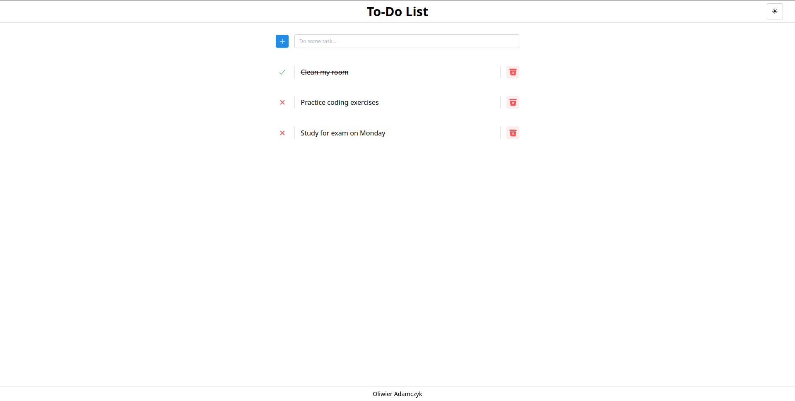
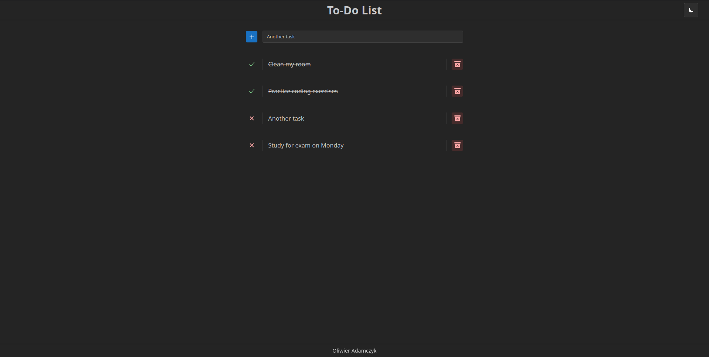

## Start

Aby uruchomić projekt trzeba pobrać [Docker](https://www.docker.com/) (`sudo pacman -S docker` na arch linux) w wersji desktop lub cli. Po pobraniu wersji cli trzeba uruchomic daemon dockera (`sudo dockerd`), następnie uruchamiamy kontener (`sudo docker-compose up --build`) i wchodzimy na http://localhost:3000. Gdy port 3000 jest zablokowany przez inną usługę wystarczy zmienić **CLIENT_PORT** w pliku [.env](.env), w przypadku innych usług także można zmienić ich port w tym pliku.

## Technologia

- [Docker](https://www.docker.com/) - Platforma dzięki której nie trzeba installować całego środowiska aby uruchomić aplikację
- [React](https://react.dev/) - Frontend aplikacji
- [Next.js](https://nextjs.org/) - react framework dla renderowania po stronie serwera 
- [Mantine](https://mantine.dev/) - Biblioteka komponentów dla React
- **PHP** - API, z którego korzysta frontend
- **MySQL** - Baza danych

## Aplikacja

Aplikacja to prosta To-Do lista, w której można dodawać, usuwać i zmieniać stan zadania.

## Screenshots

